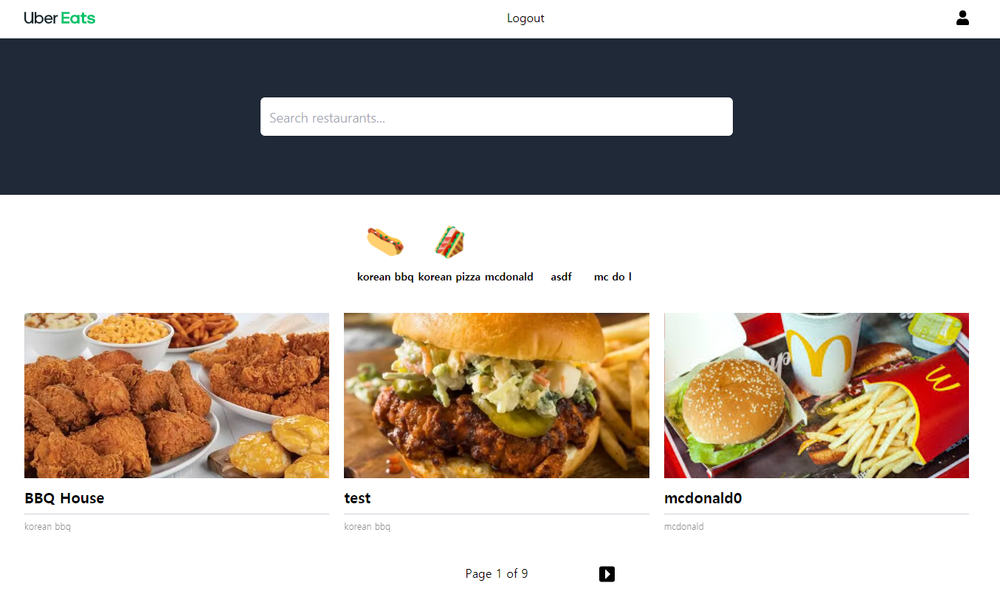

# Nuber eats front end

## Plan

- set up (#14)
- authentication
- user part
- test
- restaurant owner dashboard
- driver part

# Review

- 배포 : heroku, netlify에서 할 예정(현재 로컬에서만 작업 중)

  - server port : local 4000
  - front port : local 3000

- pages : user에 따라 다르게 표시 - owner, client, delivery

  - pagination
    - [ ] infinite scroll 로 변경 예정
    - [ ] pagination 이후 화면에 보여질 때 item들 정렬 필요
      - 현재 역순으로 보여지고 있음(ex. 6, 5 ,4)
  - navigation bar
    - [ ] hamburger menu 추가 예정
  - restaurant detail page

    - [ ] 주문 기능 동작하게 수정 필요

  - 모든 페이지 UI 개선 필요
  - 구매후기 작성 기능 추가 예정
  - 즐겨찾기 기능 추가 예정
  - 배달원 시점 페이지 만들어야 됨

## Frontend set up

- CRA(Create React Acpp)
- TailwindCSS
  - 부트스트랩과 달리 눈에 띄는 특유의 생김새가 없음
  - 조합할 수 있는 여러 클래스들이 있는데 좋바해서 쓰면 됨
  - production을 위해 build할때 사용하지 않은 클래스들을 제거해서 css크기를 줄일 수 있음
  - VScode extension : Tailwind CSS intellisense : Tailwind CSS 클래스 이름 자동 완성
  - [postCSS](https://github.com/postcss/postcss) : post process할 수 있게 해주는 라이브러리 - CSS 전용 Babel 같은 느낌
    - tailwind를 일반 css파일로 빌드하기 위해 postcss config 파일 필요
    - autoprefixer : 크로스 브라우징 되도록 지원
    - 참고 : https://fourwingsy.medium.com/postcss-%EC%86%8C%EA%B0%9C-727310aa6505
  - tailwind.config.js : tailwind를 커스터마이즈 하기 위해 필요한 파일
